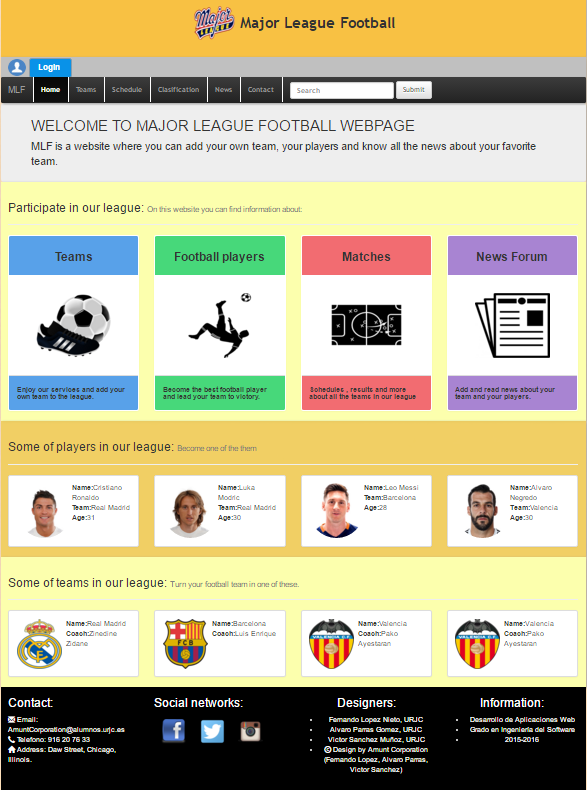
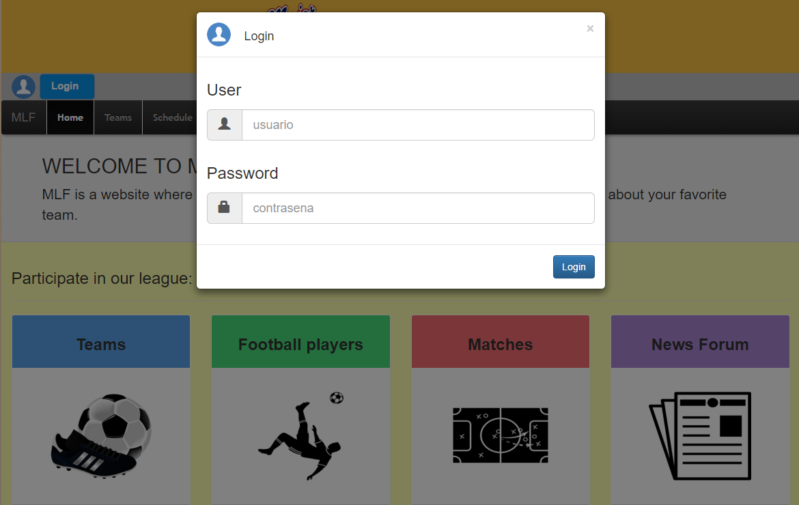
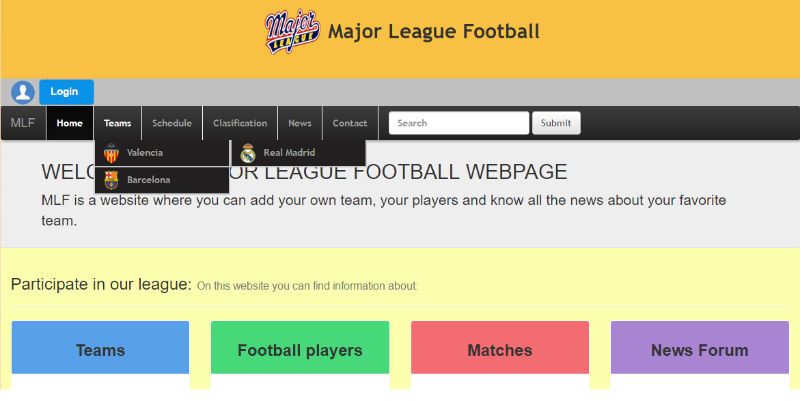
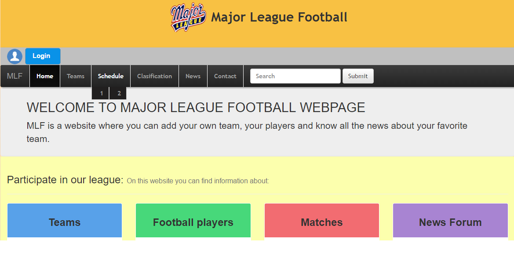
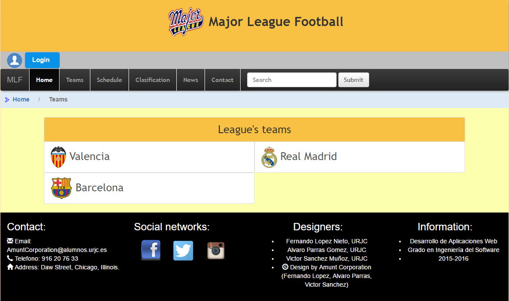
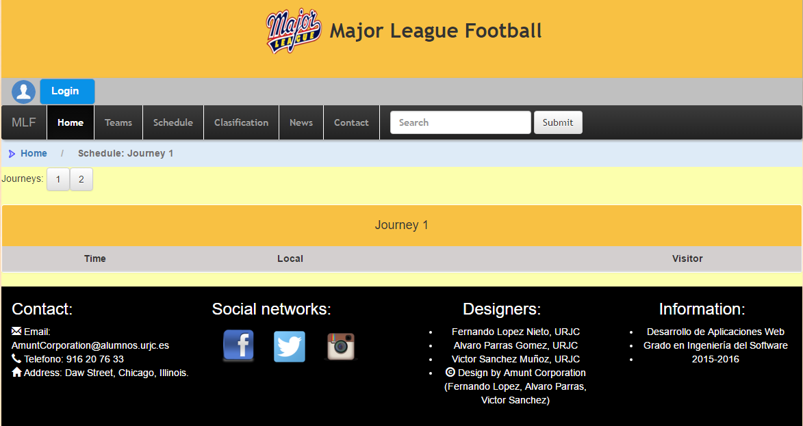
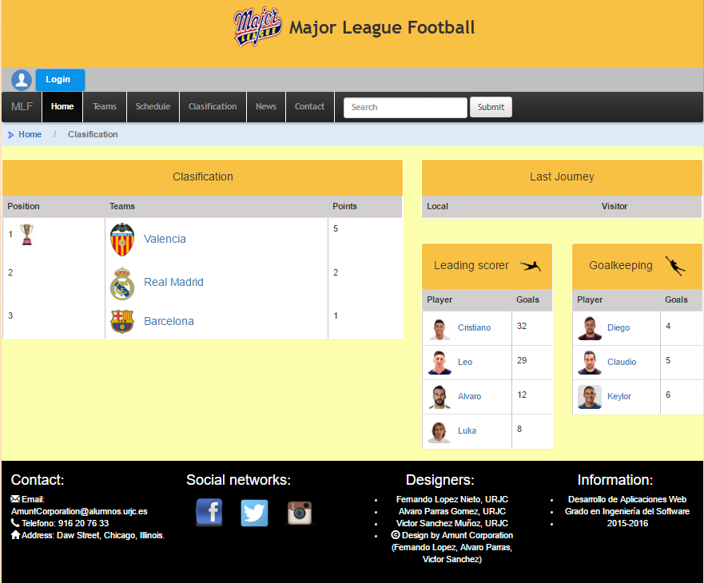
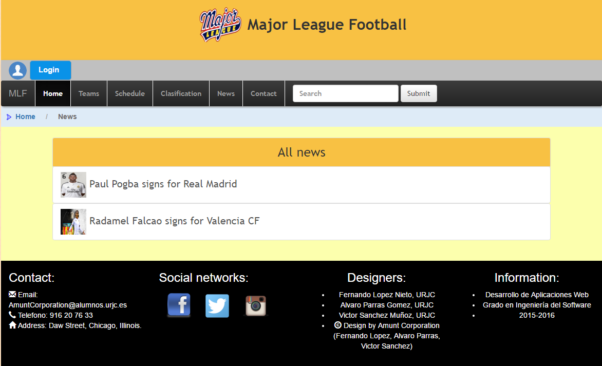

## Grado en Ingeniería del Software, Universidad Rey Juan Carlos.
Trabajo colaborativo en Desarrollo de Aplicaciones Web (2015-2016)

Idea: 
Gestión de una liga de futbol municipal
* Usuarios (3)
* Clasificacion
* Información de cada equipo (1)
* Información de cada jugador (2)
* Calendario (4)
* Noticias (5)

Parte privada:
* Los usuarios se distinguen en dos: 

El administrador: que puede hacer cambios en toda la pagina como: agregar equipo, agregar jugador, editar los puntos de un equipo, editar los resltados de un partido, crear noticias y editarlas o borrarlas

El usuario comun: que solo puede crear noticias o editarlas.

Diagrama:

Diagrama de entidades:

Capturas:
*Home y los desplegables (presentes en todas las paginas):

*Equipos:

*Calendario:               

*Clasificacion:             

*Noticias:

Descarga: 

Recomendamos la siguiente instruccion que ha sido probada en el sistema operativo : Windows

git clone https://github.com/flopezn11/DAW fase2  

git clone https://github.com/flopezn11/DAW fase3

Integrantes:
* Alvaro Parras Gomez -  a.parrasg@alumnos.urjc.es - aparrasg
* Victor Sanchez Muñoz - v.sanchezmu@alumnos.urjc.es - vicsmr
* Fernando Lopez Nieto - f.lopezn@alumnos.urjc.es - flopezn11

Video explicativo aplicación:
https://www.youtube.com/watch?v=Rn7LKYAatqQ&feature=youtu.be
